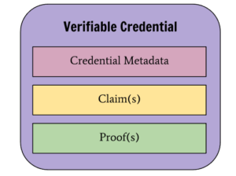

# Colofon

|Version|1.1.0|
|:------|:---|
|Authors|Christian Spruijt (SDB Groep), Jorrit Spee (Tenzinger, Santeon)|

# Introduction
This document describes how to use the Nuts-specifications in the context of a medical specialist referral, commonly known as a "BgZ-referral". This includes the specific agreements that, in addition to the specification '[Application on Nuts Notified](https://github.com/jorritspee/Application-on-Nuts-Notified-Pull)', apply to the use case of medical specialist referrals.
This document describes:
- the identifier of the use case;
- the governance;
- the information standards;
- the permitted means of authentication;
- the permitted bases; and
- the access policy.

This video gives a nice overview of the use case BgZ referral: https://youtu.be/Ms18lL1Z204?feature=shared&t=1511

# use case identifier
The identifier of the use case is 'bgz-referral'.

# Governance
- Information standards are developed and maintained by standardization organization Nictiz
- This specification is developed and maintained by <<to do>>

# Information standards
- The content and structure of the information to be exchanged complies with the Functioneel Ontwerp BgZ medisch-specialistische zorg 1.0: https://informatiestandaarden.nictiz.nl/wiki/BgZ:V1.0_BgZ_MSZ_Informatiestandaard
- The structure of the data to be exchanged and the data interfaces to be used comply with the BgZ medisch-specialistische zorg Technical Implementation Guide 1.0: https://informatiestandaarden.nictiz.nl/wiki/BgZ:V1.0_BgZ_2017_Technical_IG
- Unstructured documents containing health information are exchanged using the MedMij FHIR Implementation Guide: PDF/A 3.0.37L https://informatiestandaarden.nictiz.nl/wiki/MedMij:V2020.01/FHIR_PDFA#List_of_profiles

# Permitted means of authentication of healthcare professionals
In order to share data securely between different healthcare providers, cross-organizatonal authentication of healthcare professionals is essential. For this use case the following means of healthcare professionals are permitted:
- EmployeeID (support is mandatory): as specified in [RFC019 Employee Identity Authentication Means](https://nuts-foundation.gitbook.io/drafts/rfc/rfc019-employee-identity-means)https://nuts-foundation.gitbook.io/drafts/rfc/rfc019-employee-identity-means
- IRMA/Yivi (support is optional): as specified in [RFC002 Authentication token chapter 7.1](https://nuts-foundation.gitbook.io/drafts/rfc/rfc002-authentication-token#id-7.1.-irma)https://nuts-foundation.gitbook.io/drafts/rfc/rfc002-authentication-token#id-7.1.-irma
- UZI smartcard (support is optional): as specified in [RFC002 Authentication token chapter 7.2](https://nuts-foundation.gitbook.io/drafts/rfc/rfc002-authentication-token#id-7.2-uzi)https://nuts-foundation.gitbook.io/drafts/rfc/rfc002-authentication-token#id-7.2-uzi

# Permitted legal bases and evidence
The following legal bases are supported for the use case medical specialist referral:
- 'implicit consent'
- 'explicit prior consent': not necessary because in a referral situation consent can be implied

The following evidence is allowed for 'implicit consent':
- registration in the source system used by the Sending Organization
- verbal consent given to the Sending Organization

# Data availability
- Every party that offers services for the use case bgz-referral is responsible for the availability of its own infrastructure, the system and the Nuts-node.
- Data holders ensure the availability of all components that are part of TA-Notified-Pull-on-Nuts in accordance with the requirements for Availability, Integrity and -Confidentiality as included in {TO DO}.

# Access Policy
One aspect of a Nuts Application involves describing authorizations to certain resources. Authorizations are described in an access policy. It is the responsibility of the Sending System to adhere to the policy when resources are being requested.

This Nuts Application involves two different access policies. Most importantly, the BgZ Sender policy, since it controls access to actual data. Furthermore, there is the BgZ Receiver policy which controls notification access.

## The BgZ Receiver Policy

The BgZ Receiver policy only describes access to the Notification Task endpoint. When requesting an access token from the authorization server, no [Nuts Authorization Credentials](https://nuts-foundation.gitbook.io/rfc/rfc014-authorization-credential) are required. No user details are required
either. The `vcs` and `usi` claims in the [JWT](https://nuts-foundation.gitbook.io/rfc/rfc003-oauth2-authorization#id-4.2.2-payload) may be left empty. The `purposeOfUse` claim must contain `bgz-receiver`.

The Receiving System must check whether an HTTP POST request is performed to the Notification Task endpoint. This is the relative path that is registered under the `notification` field in the `bgz-receiver` service.

## The BgZ Sender Policy

The BgZ Sender policy describes rules for both personal and non-personal resources. For non-personal resources, the same applies as for the BgZ Receiver policy: the `vcs` and `usi` claims may be left out from
the [JWT](https://nuts-foundation.gitbook.io/rfc/rfc003-oauth2-authorization#id-4.2.2-payload).

## Non-Personal Resources (Tasks)

### Authorization Credential Task

Retrieving the Workflow Task falls under the category of non-personal resources. Since this is about accessing a single resource, a [Nuts Authorization Credential](https://nuts-foundation.gitbook.io/rfc/rfc014-authorization-credential) is required.
The credential must meet the following requirements:

| Field                                     | Description                     |
|-------------------------------------------|---------------------------------|
| `issuer`                                  | Sending Organization DID        |
| `credentialSubject.id`                    | Receiving Organization DID      |
| `credentialSubject.purposeOfUse`          | `bgz-sender`                    |
| `credentialSubject.legalBase.consentType` | `implied`                       |
| `credentialSubject.resources`             | The specific Task: `/Task/[id]` |

The Receiving System must check whether the incoming request is equal to:

```
GET [base]/Task/[id]
```

Where `[base]` represents the path registered under the `fhir` field in the `bgz-sender` service. The Sending System must check whether the used access token provides access to the requested Task resource.
Both the Sending Organization and Receiving Organization must be included when requesting the access token.

The BgZ Sender policy does not provide access to resources other than those resources listed in the credential. Two distinct Authorization Credentials must be created: one for the Task resources and one for the BgZ resources.
The `resources` field of the Authorization Credential for the Task must contain the following values:

```json
{
  "path": "/Task/[id]",
  "operations": [
    "read",
    "update"
  ],
  "userContext": false
}
```

Where `[id]` must be replaced by an actual ID. This part of the credential provides read and update access to the Task resource.

When requesting the access token, the credential must be included in the `vcs` claim and meet the above-mentioned requirements.

Part of the BgZ referral is that the Receiving Organization updates the Task status. This requires a PUT request.

### Normative Expiration Date Task Authorization

When creating an Authorization Credential, an end date must be set on the record using the `expirationDate` field. The end date must be primarily based on the patient's own preferences.
The practitioner needs to ask the patient for the preferred duration of the consent. When the patient's preferences with regard to the duration of the consent are not registered, the following norms apply:

- In case of "explicit prior consent" the end date of the authorization equals the current date plus 14 days;
- In case of "implied consent" the end date of the authorization equals the current date plus 14 days.

### Revoking the Task Authorization

The Task resource authorization does not have to be revoked; it can simply expire since the Task contains no personal data.

### Task Access Token

When requesting the access token, the Authorization Credential must be included and meet the above-mentioned requirements. No user details have to be included in the `usi` claim.
The `service` field in the credential must equal `bgz-sender`.

Access token lifetime: 300 seconds (5 minutes).

### Task Authentication Contract

For access to the Task FHIR-resource(s) (`"userContext": false`), no user details have to be included in the `usi` claim.

### Task Resource Field

The `resources` field in the Authorization Credential must contain at least one element that contains a relative path to a FHIR Task resource:

```json
{
  "path": "/Task/[id]",
  "operations": [
    "read",
    "update"
  ],
  "userContext": false
}
```

The following resource types may be included in the Authorization Credential: Task. Please see [Appendix: Workflow Task](#appendix-workflow-task) for more details.

### Task Access Control

The Sending System must only provide access to exactly those resource that are listed in the `resources` field in the Authorization Credential.
When the Sending System processes an incoming request regarding a Task, access must be provided based on the resources listed in the Authorization Credential to:

1. Task resources if any are included in the `resources` field of the Authorization Credential

Data access is not controlled by practitioner role.

### Task Search Narrowing

The Sending System must not apply search narrowing to incoming requests for Task resources.
The Receiving System must perform Task requests in the form of read requests on specific Task resource instances (conform `/Task/[id]`).

## Personal Resources (BgZ Resources)

### Authorization Credential BgZ Resources

Pulling BgZ referral resources and all related data requires a registered authorization in the form of a [Nuts Authorization Credential](https://nuts-foundation.gitbook.io/rfc/rfc014-authorization-credential).
The credential must meet the following requirements:

| Field                                     | Description                                               |
|-------------------------------------------|-----------------------------------------------------------|
| `issuer`                                  | Sending Organization DID                                  |
| `credentialSubject.id`                    | Receiving Organization DID                                |
| `credentialSubject.purposeOfUse`          | `bgz-sender`                                              |
| `credentialSubject.legalBase.consentType` | `implied`                                                 |
| `credentialSubject.subject`               | BSN as OID: `urn:oid:2.16.840.1.113883.2.4.6.3.999999990` |

The Sending System must check whether the used access token provides access to the requested Task resource. Both the Sending Organization and Receiving Organization are included when requesting the access token.

The BgZ Sender policy does not provide access to resources other than those resources listed in the credential. Two distinct Authorization Credentials will be created: one for the Task resources and one for the BgZ resources.

#### Resources
The `resources` field in the Authorization Credential must contain at least one element that contains a relative path to a BgZ FHIR resource:

```json
{
  "path": "/[type]/[/$operation][?query]",
  "operations": [
    "search"
  ],
  "userContext": true
}
```

For all FHIR *search* operations that are part of the [MedMij FHIR Implementation Guide: BgZ](https://informatiestandaarden.nictiz.nl/wiki/MedMij:V2020.01/FHIR_BGZ_2017#PHR:_request_message), a rule must be included.
`/[path]` must be replaced by the FHIR type. `/[$operation]` must be replaced by a possibly mandatory operation, e.g., `$lastn`. `[?queries]` must be replace by possibly mandatory query parameters, e.g., `code=http://snomed.info/sct|365508006`.

The following resource types may be included in the Authorization Credential:

| Resource Type              | Operations |
|----------------------------|------------|
| Patient                    | Read       |
| Coverage                   | Search     |
| Consent                    | Search     |
| Condition                  | Search     |
| Observation                | Search     |
| NutritionOrder             | Search     |
| Flag                       | Search     |
| AllergyIntolerance         | Search     |
| MedicationStatement        | Search     |
| MedicationRequest          | Search     |
| MedicationDispense         | Search     |
| DeviceUseStatement         | Search     |
| Immunization               | Search     |
| Procedure                  | Search     |
| Encounter                  | Search     |
| ProcedureRequest           | Search     |
| ImmunizationRecommendation | Search     |
| DeviceRequest              | Search     |
| Appointment                | Search     |
| DocumentReference          | Read       |
| Binary                     | Read       |

Please see the [FHIR Implementation Guide BgZ](https://informatiestandaarden.nictiz.nl/wiki/MedMij:V2020.01/FHIR_BGZ_2017#PHR:_request_message) for more details.
Moreover, please note that resources of type Binary should only be included in the Authorization Credential and not in the Workflow Task
(resources of type DocumentReference should be included in the Workflow Task, which refer to Binary resources).

When requesting the access token, the credential must be included in the `vcs` claim and meet the above-mentioned requirements.

### Normative End Date BgZ Resources Authorization

When creating an Authorization Credential, an end date must be set on the record using the `expirationDate` field. The end date must be primarily based on the patient's own preferences.
The practitioner needs to ask the patient for the preferred duration of the consent. When the patient's preferences with regard to the duration of the consent are not registered, the following norms apply:

- In case of "explicit prior consent" the end date of the authorization equals the current date plus 14 days;
- In case of "implied consent" the end date of the authorization equals the current date plus 14 days.

### Revoking the BgZ Resources Authorization

When the BgZ referral is complete, it is no longer necessary for the Receiving Organization to pull resources. The Authorization Credential for the BgZ resources can then be revoked.

State machine for revoking authorization for BgZ resources:

| Status      | Comment                                                                                                                                                                     |
|-------------|-----------------------------------------------------------------------------------------------------------------------------------------------------------------------------|
| `requested` | Notification is sent                                                                                                                                                        |
| `received`  | Receiving Organization has received request                                                                                                                                 |
| `accepted`  | When incoming request is accepted                                                                                                                                           |
| `rejected`  | When Receiving Organization rejects referral → PUT task.status, Sending Organization should kill Authorization Credential                                                   |
| `cancelled` | Sending Organization cancels referral, or Receiving Organization cancels after first accepting → PUT task.status, Sending Organization should kill Authorization Credential |
| `completed` | When treatment at Receiving Organization finishes → PUT task.status, Sending Organization should kill Authorization Credential                                              |                                                                                                      |

### Access Token BgZ FHIR Resources

When requesting the access token, the Authorization Credential must be included and meet the above-mentioned requirements. User details must be included in the `usi` claim.
The `service` field in the credential must equal `bgz-sender`.

Access token lifetime: 300 seconds (5 minutes).

### Authentication Contract BgZ FHIR Resources

For access to the BgZ FHIR-resource(s) (`"userContext": true`), user details have to be included in the `usi` claim.

### BgZ Resources Access Control

The Sending System must only provide access to exactly those resource that are listed in the `resources` field in the Authorization Credential.
When the Sending System processes an incoming request regarding BgZ resources, access must be provided based on the resources listed in the Authorization Credential to:

1. Patient resource for the patient whose BSN is included in the `credentialSubject.subject` field of the Authorization Credential
2. Remaining resources if any are included in the `resources` field in the Authorization Credential

Data access (in this particular Nuts Application) is not controlled by practitioner role.

### Search Narrowing

The Sending System must apply search narrowing. For incoming requests (e.g., `/Patient`) the following applies:

- The response only contains the requested resources for which the Receiving Organization is authorized based on the Authorization Credentials and the Access Policy;
- The response has the expected format for the incoming request. E.g., an incoming `/Patient` or `/Observation` request must result in a Bundle response.

The table below specifies how search narrowing must be applied. The first column describes the requests a Receiving Organization can perform.
The second column describes how the requests must be executed by the Sending System in relation to the Authorization Credentials and the Access Policy.

| Request to be sent by the Receiving System                                               | Request to be executed by the Sending System                                                                                                                                         |
|------------------------------------------------------------------------------------------|--------------------------------------------------------------------------------------------------------------------------------------------------------------------------------------|
| GET [base]/Patient/[id]?_include=Patient:general-practitioner                            | GET [base]/Patient/[id]?_include=Patient:general-practitioner                                                                                                                        |
| GET [base]/Coverage?_include=Coverage:payor:Patient&_include=Coverage:payor:Organization | GET [base]/Coverage?_include=Coverage:payor:Patient&_include=Coverage:payor:Organization<b>&subscriber=http://fhir.nl/fhir/NamingSystem/bsn\|[BSN from Authorization Credential]</b> |
| GET [base]/Consent                                                                       | GET [base]/Consent<b>?patient=http://fhir.nl/fhir/NamingSystem/bsn\|[BSN from Authorization Credential]</b>                                                                          |
| GET [base]/Observation/$lastn?category=X                                                 | GET [base]/Observation/$lastn?category=X&<b>patient=http://fhir.nl/fhir/NamingSystem/bsn\|[BSN from Authorization Credential]</b>                                                    |
| GET [base]/Condition                                                                     | GET [base]/Condition<b>?patient=http://fhir.nl/fhir/NamingSystem/bsn\|[BSN from Authorization Credential]</b>                                                                        |
| GET [base]/Observation/$lastn?code=X                                                     | GET [base]/Observation/$lastn?code=X<b><b>&patient=http://fhir.nl/fhir/NamingSystem/bsn\|[BSN from Authorization Credential]</b></b>                                                 |
| GET [base]/NutritionOrder                                                                | GET [base]/NutritionOrder<b>?patient=http://fhir.nl/fhir/NamingSystem/bsn\|[BSN from Authorization Credential]</b>                                                                   |
| GET [base]/Flag                                                                          | GET [base]/Flag<b>?patient=http://fhir.nl/fhir/NamingSystem/bsn\|[BSN from Authorization Credential]</b>                                                                             |
| GET [base]/AllergyIntolerance                                                            | GET [base]/AllergyIntolerance<b>?patient=http://fhir.nl/fhir/NamingSystem/bsn\|[BSN from Authorization Credential]</b>                                                               |
| GET [base]/MedicationStatement?category=X                                                | GET [base]/MedicationStatement?category=X<b>&patient=http://fhir.nl/fhir/NamingSystem/bsn\|[BSN from Authorization Credential]</b>                                                   |
| GET [base]/MedicationRequest?category=X                                                  | GET [base]/MedicationRequest?category=X<b>&patient=http://fhir.nl/fhir/NamingSystem/bsn\|[BSN from Authorization Credential]</b>                                                     |
| GET [base]/MedicationDispense?category=X                                                 | GET [base]/MedicationDispense?category=X<b>&patient=http://fhir.nl/fhir/NamingSystem/bsn\|[BSN from Authorization Credential]</b>                                                    |
| GET [base]/DeviceUseStatement?_include=DeviceUseStatement:device                         | GET [base]/DeviceUseStatement?_include=DeviceUseStatement:device<b>&patient=http://fhir.nl/fhir/NamingSystem/bsn\|[BSN from Authorization Credential]</b>                            |
| GET [base]/Immunization?status=completed                                                 | GET [base]/Immunization?status=completed<b>&patient=http://fhir.nl/fhir/NamingSystem/bsn\|[BSN from Authorization Credential]</b>                                                    |
| GET [base]/Procedure?category=X                                                          | GET [base]/Procedure?category=X<b>&patient=http://fhir.nl/fhir/NamingSystem/bsn\|[BSN from Authorization Credential]</b>                                                             |
| GET [base]/Encounter?class=X                                                             | GET [base]/Encounter?class=X<b>&patient=http://fhir.nl/fhir/NamingSystem/bsn\|[BSN from Authorization Credential]</b>                                                                |
| GET [base]/ProcedureRequest?status=active                                                | GET [base]/ProcedureRequest?status=active<b>&patient=http://fhir.nl/fhir/NamingSystem/bsn\|[BSN from Authorization Credential]</b>                                                   |
| GET [base]/ImmunizationRecommendation                                                    | GET [base]/ImmunizationRecommendation<b>?patient=http://fhir.nl/fhir/NamingSystem/bsn\|[BSN from Authorization Credential]</b>                                                       |
| GET [base]/DeviceRequest?status=active&_include=DeviceRequest:device                     | GET [base]/DeviceRequest?status=active&_include=DeviceRequest:device<b>&patient=http://fhir.nl/fhir/NamingSystem/bsn\|[BSN from Authorization Credential]</b>                        |
| GET [base]/Appointment?status=booked,pending,proposed                                    | GET [base]/Appointment?status=booked,pending,proposed<b>&patient=http://fhir.nl/fhir/NamingSystem/bsn\|[BSN from Authorization Credential]</b>                                       |

# Appendix: Notification Task

## Example

```json
{
  "resourceType": "Task",
  "basedOn": [
    {
      "reference": "Task/Workflow-Task-123455"
    }
  ],
  "groupIdentifier": {
    "system": "https://tools.ietf.org/html/rfc4122",
    "value": "urn:uuid:484639e6-e647-464c-8722-6e8a73cda4e0"
  },
  "identifier": {
    "system": "https://tools.ietf.org/html/rfc4122",
    "value": "urn:uuid:6128cfe7-0e89-4d37-ba90-e4ca3b3fcbbe"
  },
  "status": "requested",
  "intent": "proposal",
  "requester": {
    "agent": {
      "identifier": {
        "system": "https://www.w3.org/ns/did/v1",
        "value": "did:nuts of fhir service endpoint op bgz-sender vendor"
      }
    },
    "onBehalfOf": {
      "identifier": {
        "system": "https://www.w3.org/ns/did/v1",
        "value": "did:nuts of bgz-sender organization"
      }
    }
  },
  "owner": {
    "identifier": {
      "system": "https://www.w3.org/ns/did/v1",
      "value": "did:nuts of bgz-receiver organization"
    }
  },
  "input": [
    {
      "type": {
        "coding": [
          {
            "system": "http://xxx.nl/fhir/CodeSystem/TaskParameterType",
            "code": "authorization-base"
          }
        ]
      },
      "valueString": "did:nuts of NutsAuthorizationCredential for BgZ-resources"
    },
    {
      "type": {
        "coding": [
          {
            "system": "http://fhir.nl/fhir/NamingSystem/TaskCodes",
            "code": "get-workflow-task"
          }
        ]
      },
      "valueBoolean": true
    }
  ]
}
```

# Appendix: Workflow Task

The Task resource that represents the workflow for a referral must ultimately be determined by Nictiz. The basis is the [eOverdracht Task](https://simplifier.net/packages/nictiz.fhir.nl.stu3.eoverdracht/1.0.0-rc5/files/588946).

## Workflow Task Input Elements

The Task input type must be included in an encoded way. One or two codes must be included depending on the context.

### Complete BgZ Section

In case of a complete section from the BgZ document, only the LOINC code of the section is included. E.g., for Problem:

```json
{
  "type": {
    "coding": [
      {
        "system": "http://loinc.org",
        "code": "11450-4",
        "display": "Problem list - Reported"
      }
    ]
  },
  "valueString": "Condition"
}
```

In the `valueString` the (relative of absolute) address of the REST endpoint of the FHIR search must be included.

### Subset of a BgZ Section

When the input is a subset of a BgZ section, the LOINC code of the BgZ section must be included as well as the SNOMED CT code that further specifies the resource. E.g., for LivingSituation:

```json
{
  "type": {
    "coding": [
      {
        "system": "http://loinc.org",
        "code": "29762-2",
        "display": "Social history Narrative"
      },
      {
        "system": "http://snomed.info/sct",
        "code": "365508006",
        "display": "Residence and accommodation circumstances - finding"
      }
    ]
  },
  "valueString": "Observation/$lastn?code=http://snomed.info/sct|365508006"
}
```

### LOINC and SNOMED CT Code Table

Please see the following table for detail codes:

[Codetabel Workflow Task BgZ-verwijzing - Google Spreadsheets](https://docs.google.com/spreadsheets/d/11AJPwdgxCq1rxxjgFDgYK7z7rWlJTVpL2rQ21ipurj4/edit?usp=sharing)

## Example

```json
{
  "intent": "order",
  "owner": {
    "reference": "Organization/nl-core-organization-bgz-receiver-test-1-10b-01",
    "display": "EF-zkh Zuid"
  },
  "id": "BgZ-Task-eov-test-1-10b-01",
  "resourceType": "Task",
  "authoredOn": "2023-04-13T15:01:54+02:00",
  "input": [
    {
      "type": {
        "coding": [
          {
            "system": "http://loinc.org",
            "code": "79191-3",
            "display": "Patient demographics panel"
          }
        ],
        "text": "Demografie en identificatie"
      },
      "valueString": "Patient?_include=Patient%3Ageneral-practitioner"
    },
    {
      "type": {
        "coding": [
          {
            "system": "http://loinc.org",
            "code": "48768-6",
            "display": "Payment sources Document"
          }
        ],
        "text": "Financiële informatie"
      },
      "valueString": "Coverage?_include=Coverage%3Apayor%3AOrganization&_include=Coverage%3Apayor%3APatient"
    },
    {
      "type": {
        "coding": [
          {
            "system": "http://snomed.info/sct",
            "code": "11291000146105",
            "display": "Treatment instructions"
          }
        ],
        "text": "Behandelaanwijzing"
      },
      "valueString": "Consent?category=http%3A%2F%2Fsnomed.info%2Fsct%7C11291000146105"
    },
    {
      "type": {
        "coding": [
          {
            "system": "http://snomed.info/sct",
            "code": "11341000146107",
            "display": "Living will and advance directive record"
          }
        ],
        "text": "Wilsverklaring"
      },
      "valueString": "Consent?category=http%3A%2F%2Fsnomed.info%2Fsct%7C11341000146107"
    },
    {
      "type": {
        "coding": [
          {
            "system": "http://loinc.org",
            "code": "47420-5",
            "display": "Functional status assessment note"
          }
        ],
        "text": "Functionele status"
      },
      "valueString": "Observation/$lastn?category=http%3A%2F%2Fsnomed.info%2Fsct%7C118228005%2Chttp%3A%2F%2Fsnomed.info%2Fsct%7C384821006"
    },
    {
      "type": {
        "coding": [
          {
            "system": "http://loinc.org",
            "code": "11450-4",
            "display": "Problem list - Reported"
          }
        ],
        "text": "Probleem"
      },
      "valueString": "Condition"
    },
    {
      "type": {
        "coding": [
          {
            "system": "http://snomed.info/sct",
            "code": "365508006",
            "display": "Residence and accommodation circumstances - finding"
          }
        ],
        "text": "Woonsituatie"
      },
      "valueString": "Observation/$lastn?code=http%3A%2F%2Fsnomed.info%2Fsct%7C365508006"
    },
    {
      "type": {
        "coding": [
          {
            "system": "http://snomed.info/sct",
            "code": "228366006",
            "display": "Finding relating to drug misuse behavior"
          }
        ],
        "text": "Drugsgebruik"
      },
      "valueString": "Observation?code=http%3A%2F%2Fsnomed.info%2Fsct%7C228366006"
    },
    {
      "type": {
        "coding": [
          {
            "system": "http://snomed.info/sct",
            "code": "228273003",
            "display": "Finding relating to alcohol drinking behavior"
          }
        ],
        "text": "Alcoholgebruik"
      },
      "valueString": "Observation?code=http%3A%2F%2Fsnomed.info%2Fsct%7C228273003"
    },
    {
      "type": {
        "coding": [
          {
            "system": "http://snomed.info/sct",
            "code": "365980008",
            "display": "Tobacco use and exposure - finding"
          }
        ],
        "text": "Tabaksgebruik"
      },
      "valueString": "Observation?code=http%3A%2F%2Fsnomed.info%2Fsct%7C365980008"
    },
    {
      "type": {
        "coding": [
          {
            "system": "http://snomed.info/sct",
            "code": "11816003",
            "display": "Diet education"
          }
        ],
        "text": "Voedingsadvies"
      },
      "valueString": "NutritionOrder"
    },
    {
      "type": {
        "coding": [
          {
            "system": "http://loinc.org",
            "code": "75310-3",
            "display": "Health concerns Document"
          }
        ],
        "text": "Alert"
      },
      "valueString": "Flag"
    },
    {
      "type": {
        "coding": [
          {
            "system": "http://loinc.org",
            "code": "48765-2",
            "display": "Allergies and adverse reactions Document"
          }
        ],
        "text": "Allergieën"
      },
      "valueString": "AllergyIntolerance"
    },
    {
      "type": {
        "coding": [
          {
            "system": "http://loinc.org",
            "code": "46264-8",
            "display": "History of medical device use"
          }
        ],
        "text": "Medische hulpmiddelen"
      },
      "valueString": "DeviceUseStatement?_include=DeviceUseStatement%3Adevice"
    },
    {
      "type": {
        "coding": [
          {
            "system": "http://loinc.org",
            "code": "11369-6",
            "display": "History of Immunization Narrative"
          }
        ],
        "text": "Vaccinaties"
      },
      "valueString": "Immunization?status=completed"
    },
    {
      "type": {
        "coding": [
          {
            "system": "http://loinc.org",
            "code": "85354-9",
            "display": "Blood pressure"
          }
        ],
        "text": "Bloeddruk"
      },
      "valueString": "Observation/$lastn?code=http%3A%2F%2Floinc.org%7C85354-9"
    },
    {
      "type": {
        "coding": [
          {
            "system": "http://loinc.org",
            "code": "29463-7",
            "display": "Body weight"
          }
        ],
        "text": "Lichaamsgewicht"
      },
      "valueString": "Observation/$lastn?code=http%3A%2F%2Floinc.org%7C29463-7"
    },
    {
      "type": {
        "coding": [
          {
            "system": "http://loinc.org",
            "code": "8302-2",
            "display": "Body height"
          }
        ],
        "text": "Lichaamslengte"
      },
      "valueString": "Observation/$lastn?code=http%3A%2F%2Floinc.org%7C8302-2%2Chttp%3A%2F%2Floinc.org%7C8306-3%2Chttp%3A%2F%2Floinc.org%7C8308-9"
    },
    {
      "type": {
        "coding": [
          {
            "system": "http://loinc.org",
            "code": "47519-4",
            "display": "History of Procedures Document"
          }
        ],
        "text": "Verrichtingen"
      },
      "valueString": "Procedure?category=http%3A%2F%2Fsnomed.info%2Fsct%7C387713003"
    },
    {
      "type": {
        "coding": [
          {
            "system": "http://loinc.org",
            "code": "46240-8",
            "display": "History of Hospitalizations+Outpatient visits Narrative"
          }
        ],
        "text": "Contacten"
      },
      "valueString": "Encounter?class=http%3A%2F%2Fhl7.org%2Ffhir%2Fv3%2FActCode%7CIMP,http%3A%2F%2Fhl7.org%2Ffhir%2Fv3%2FActCode%7CACUTE,http%3A%2F%2Fhl7.org%2Ffhir%2Fv3%2FActCode%7CNONAC"
    },
    {
      "type": {
        "coding": [
          {
            "system": "http://loinc.org",
            "code": "77599-9",
            "display": "Additional documentation"
          }
        ],
        "text": "Correspondentie"
      },
      "valueString": "DocumentReference?status=current"
    },
    {
      "type": {
        "coding": [
          {
            "system": "http://snomed.info/sct",
            "code": "15220000",
            "display": "Laboratory Test"
          }
        ],
        "text": "LaboratoriumUitslag"
      },
      "valueString": "Observation/$lastn?category=http%3A%2F%2Fsnomed.info%2Fsct%7C275711006&_include=Observation:specimen"
    }
  ],
  "for": {
    "reference": "Patient/XXX-Hondius",
    "display": "M van XXX_Hondius"
  },
  "status": "requested",
  "requester": {
    "agent": {
      "reference": "Practitioner/nl-core-practitioner-eov-test-1-10b-01",
      "display": "Ronald Tuinman"
    },
    "onBehalfOf": {
      "reference": "Organization/nl-core-organization-bgz-test-1a",
      "display": "BgZ-Verwijzende-Zorgorg"
    }
  },
  "code": {
    "coding": [
      {
        "system": "http://snomed.info/sct",
        "display": "verwijzen van patiënt ",
        "code": "3457005"
      }
    ]
  },
  "meta": {
    "profile": [
      "http://nictiz.nl/fhir/StructureDefinition/BgZ-verwijzing-Task"
    ]
  }
}
```

# Appendix: Authorization Credentials

Two types of Authorization Credentials are used:

1. For Workflow Tasks: the Sending Organization provides the Receiving Organization with read and update access to the Task resource;
2. For BgZ resources: the Sending Organization provides the Receiving Organization with read access to the BgZ resources.

An Authorization Credential has three parts:



Specification and examples:

[RFC014 Nuts Authorization Credential - V1](https://nuts-foundation.gitbook.io/rfc/rfc014-authorization-credential#id-12.-examples)

## Credential Metadata

The metadata is the same for both types of credentials.

```json
{
  "@context": [
    "https://www.w3.org/2018/credentials/v1",
    "https://nuts.nl/credentials/v1"
  ],
  "id": "did:nuts:identifier-van-credential",
  "type": [
    "VerifiableCredential",
    "NutsAuthorizationCredential"
  ],
  "issuer": "did:nuts:identifier-van-verwijzende-organisatie",
  "issuanceDate": "2010-01-01T19:73:24Z",
  "expirationDate": "2010-02-01T19:73:24Z"
}
```

## Claims

Claims must be included in the `credentialSubject` field.

### Workflow Task Credential Subject

```json
{
  "id": "did:nuts:identifier-of-bgz-receiver",
  "resources": [
    {
      "path": "/Task/workflowtask-123",
      "operations": [
        "read",
        "update"
      ],
      "userContext": false
    }
  ],
  "purposeOfUse": "bgz-sender"
}
```

### Issue Workflow Task Authorization Credential

```http request
POST {{node}}/internal/vcr/v2/issuer/vc
Content-Type: application/json

{
  "issuer": "`did:nuts:75AdvheNAqUxXajFuo8VwppFdeHDg1ypFaSv7j6Jntvw",  // Zuyderland (Sending Organization)
  "type": "NutsAuthorizationCredential",
  "credentialSubject": {
    "id": "did:nuts:DW7R4nk1he5aP7ZRMBUT8yB6RYYTUsKsHBn5eYrgQj6Y", // MUMC (Receiving Organization)
    "resources": [
      {
        "path": "/task/1",
        "operations": [
          "read",
          "update"
        ],
        "userContext": false
      }
    ],
    "purposeOfUse": "bgz-sender"
  },
  "visibility": "private"
}
```

## BgZ Resources Credential Subject

```json
{
  "id": "did:nuts:dentifier-van-ontvangende-organisatie",
  "legalBase": {
    "consentType": "implicit"
  },
  "resources": [
    {
      "path": "/Patient",
      "operations": [
        "search"
      ],
      "userContext": true
    },
    {
      "path": "/Consent?category=http://snomed.info/sct|11291000146105",
      "operations": [
        "search"
      ],
      "userContext": true
    },
    {
      "path": "/Observation/$lastn?code=http://snomed.info/sct|365508006",
      "operations": [
        "search"
      ],
      "userContext": true
    },
    {
      "path": "/[Resource-type][/$operation][?query]",
      "operations": [
        "search"
      ],
      "userContext": true
    }
  ],
  "purposeOfUse": "bgz-sender",
  "subject": "urn:oid:2.16.840.1.113883.2.4.6.3:123456780"
}
```

### Issue BgZ Resources Authorization Credential

```http request
POST {{node}}/internal/vcr/v2/issuer/vc
Content-Type: application/json

{
  "issuer": "did:nuts:75AdvheNAqUxXajFuo8VwppFdeHDg1ypFaSv7j6Jntvw",
  "type": "NutsAuthorizationCredential",
  "credentialSubject": {
    "id": "did:nuts:DW7R4nk1he5aP7ZRMBUT8yB6RYYTUsKsHBn5eYrgQj6Y",
    "resources": [
      {
        "path": "/patient/1",
        "operations": [
          "read"
        ],
        "userContext": false
      }
    ],
    "purposeOfUse": "bgz-sender",
    "subject": "urn:oid:2.16.840.1.113883.2.4.6.3:123456780"
  },
  "visibility": "private"
}
```

## Proof

The `proof` section is created automatically by the Nuts node conform [RFC011](https://nuts-foundation.gitbook.io/rfc/rfc011-verifiable-credential#id-3.2.1-jsonwebsignature2020).

```json
{
  "issuer": "did:nuts:ByJvBu2Ex21tNdn5s8FBnqmRBTCGkqRHms5ci7gKM8rg",
  "type": "NutsOrganizationCredential",
  "credentialSubject": {
    "id": "did:nuts:9UKf9F9sRtiq4gR3bxfGQAeARtJeU8jvPqfWJcFP6ziN",
    "organization": {
      "name": "Because we care B.V.",
      "city": "IJbergen"
    }
  },
  "visibility": "public"
}
```

